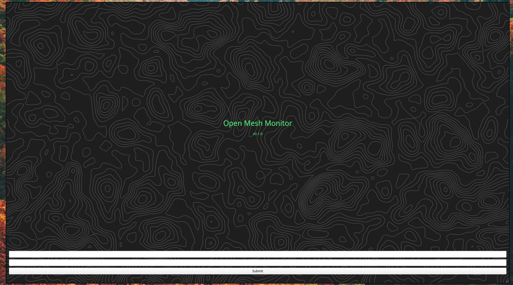
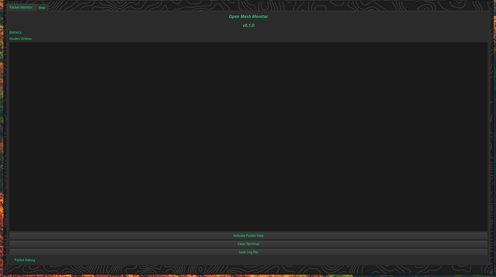
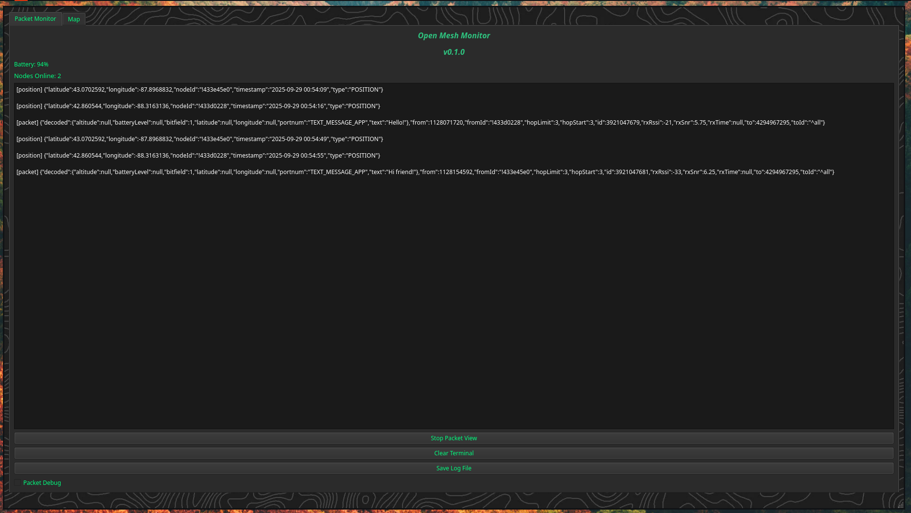
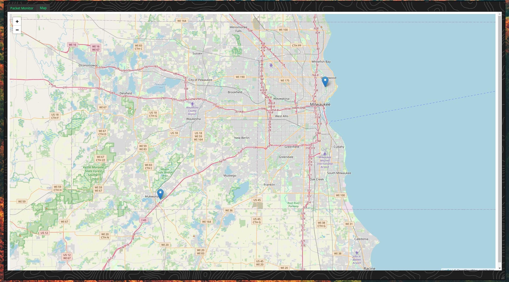
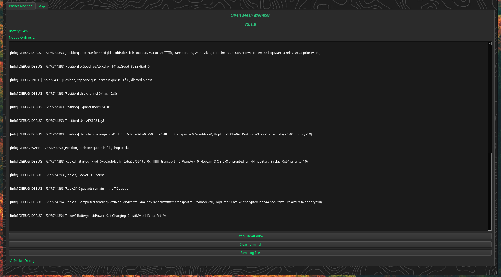

Open Meshtastic Monitor 

Features
    -Real time packet monitoring 

    -JSON packet formatting 

    -Full Packet Debug logs via Serial Port

    -Auto Device Detection 

    -Battery level monitoring

    -GPS Location monitoring with a live interactive map 

    -User Authentication 

    -Save logs 

Requirements
    -Qt 6.x

    -C++ 17 or greater

    -CMake 3.16+

    -Linux (Arch was used for development, in theory most mainstream distros should work)

    -Heltec V3 Meshtastic device (Only has been tested with Heltec V3 more units will be added at a later date, other devices with a CP2102 USB to UART brige may work as well)

Install
    -Ensure all dev tools are installed 
        qt6-base-dev qt6-serialport-dev cmake build-essential

    -Clone and bulid
        git clone https://github.com/yourusername/meshtastic-monitor.git
        cd meshtastic-monitor
        mkdir build && cd build
        cmake ..
        make -j$(nproc)
        ./meshtastic-monitor

Usage
    -Connect the Meshtastic Device to your PC via USB
    
    -Launch the application 
    
    -Login with
        Username: admin
        Password: admin
    
    -Click "Start Packet View" and the app should detect your device and start reading in packets

Security Nodes
    -As of now the admin credentails are the only way to login (This will be fixed VERY soon!)

Author
    Dennis Smith
    GitHub: https://github.com/Dennis-Smith414/
    Personal Site: https://dnstech.xyz/
    LinkedIn: https://www.linkedin.com/in/dennis-smith-73293024b/
    Email: dennis@dnstech.xyz

Legal Notice
    Meshtastic® is a registered trademark of Meshtastic LLC. Meshtastic software components are released under various licenses, see [GitHub](https://github.com/meshtastic) for details. No warranty is provided - use at your own risk.

    **Note**: This project is not affiliated with or endorsed by the Meshtastic project.

Screen Shots
    -Login Screen 
    

    -Main Screen
    

    -Pack Logging
    

    -Map Screen 
    

    -Debug Logging
    
